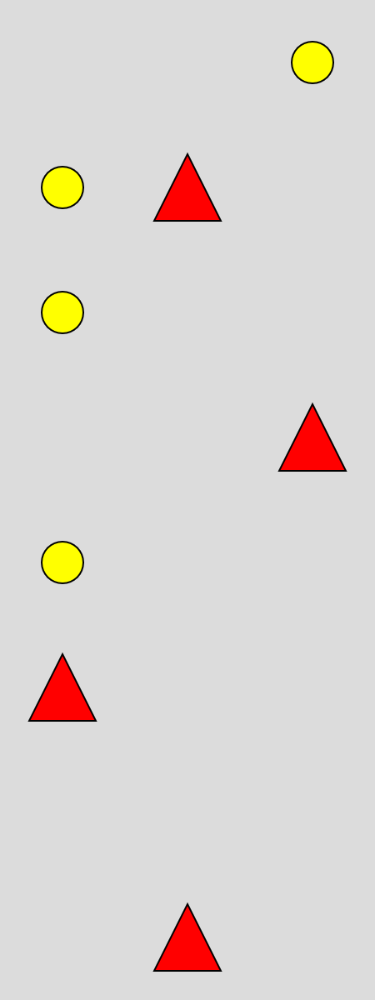
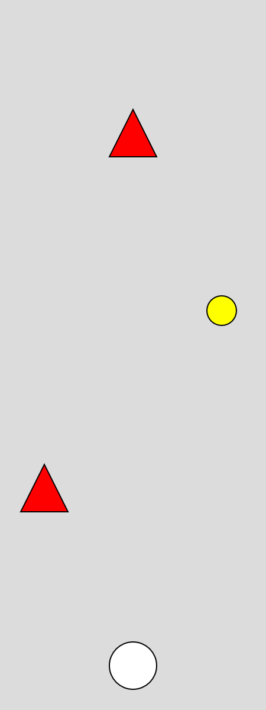

## Part 1: Drawing the game grid
The goal in this chapter is to draw the grid that our game takes place in. You should get something that looks like this:

{width=75}

- Navigate to **[https://editor.p5js.org/j-amg/sketches/noPdotvRS](https://editor.p5js.org/j-amg/sketches/noPdotvRS)**
- Press file, then duplicate
- In the top right of the screen, press log in, log in with Google, and then enter your matamoe account information
- Press CTRL + S to save your sketch
- Enable "Auto Refresh"
- Open settings, enable "Autocomplete Hinter"
- Open a new tab in your browser, and navigate to __[the p5.js reference](https://p5js.org/reference/)__

The instructions for the first part of this project are written in the code. Once you have completed the tasks move on to part 2.

## Part 2: The player
We should have a grid that has a collection of shapes that represent our game world. We now need to add our player, and add the ability to move left and right between the columns of our grid.

Instead of setting another value inside our grid, and drawing from the render function. We are going to draw the player as a seperate shape above the grid.

{width=75}

I'm drawing my player with a circle.

### Drawing the player

Add a global variable (placed above your setup function) that will store which column the player is currently in:

```js
    let player_index = 1
```

Because I'm using a grid with 3 columns, setting the value to 1 means the player will start in the middle column.

#### Task:

At the bottom of your render function (make sure you are outside of the closing brackets for the for loops) draw a new shape
that will represent your player using the player_index value as the x position and the height of your grid - 1 as the y position.
(Because the player should be placed at the bottom of the grid)

### Moving the player
Now that we are drawing the player based on a global variable, if we update that variable we can change where the player is drawn.

Create a new function:

```js
    function keyPressed() {
      if (key === 'a') {
        // add your code here
      } else if (key === 'd') {
        // add your code here
      }
    }
```

The above code will detect when a key is pressed.

#### Task:

Update the player_index value when a key is pressed. Find a way to prevent the player from being drawn off screen.

## Part 3: Moving the grid
At an increasing rate, we need to move each of the obstacles in the grid downwards towards the player. An easy way of doing this is
to insert a new row at the start of our grid array, and then delete the row at the end. Each of the rows in-between will then be shuffled forwards, making them move down.

If we inserted a new row into our grid every draw frame, the obstacles would move very quickly. We need to only update the grid every x amount of seconds.

Add two new global variables:

```js
    let last_time_step = 0
    let time_step = 1000
```
time_step will represent the amount of time we wait (in milliseconds) before we update the grid.

last_time_step will represent the last time that the grid was updated.

To check if we need to update the grid we can check if the current amount of time the game has been running for is
greater than the last time we updated the grid + our time step.

Add the following code: (Note that you should replace your current draw function with this, make sure you don't have two)


```js
    function draw() {
    
      background(220);
      render()
      
      if (millis() > last_time_step + time_step) {
        update()
        last_time_step = millis()
      }
    }

    function update() {
      grid.pop()
      grid.splice(0, 0, create_row())
    }

    function create_row() {
      let row = [0,0,0]
      
      // Add your code here.

      return row
    }
```

With this code added, you should see your grid slowly move downwards.

create_row is a function that determines what should in the row that we are adding each update. By default it will return a row
with all 0's.

#### Task:
Add code that will add values (representing your game objects) to your row. Consider using randomness so that each new row that gets added will be different.

Consider that if an obstacle gets placed on every new row, there may be a scenario where they form a line that the player can't navigate around. You may want to look at ways that you can space out how frequently an obstacle is placed.

#### Task:
Add code that will increase the speed that the grid updates the longer that the game runs.

## Part 4: Player collision
The final step in the project is to detect when the player collides with an obstacle. For example, if the player hits a spike, they have to restart.

#### Task:
Every time the grid updates, check the spot in the grid that the player is currently on top of. This will be the final row of the array since that's where we are drawing the player. If the value of that spot is an obstacle find a way to stop the game from running, or to restart the game.


